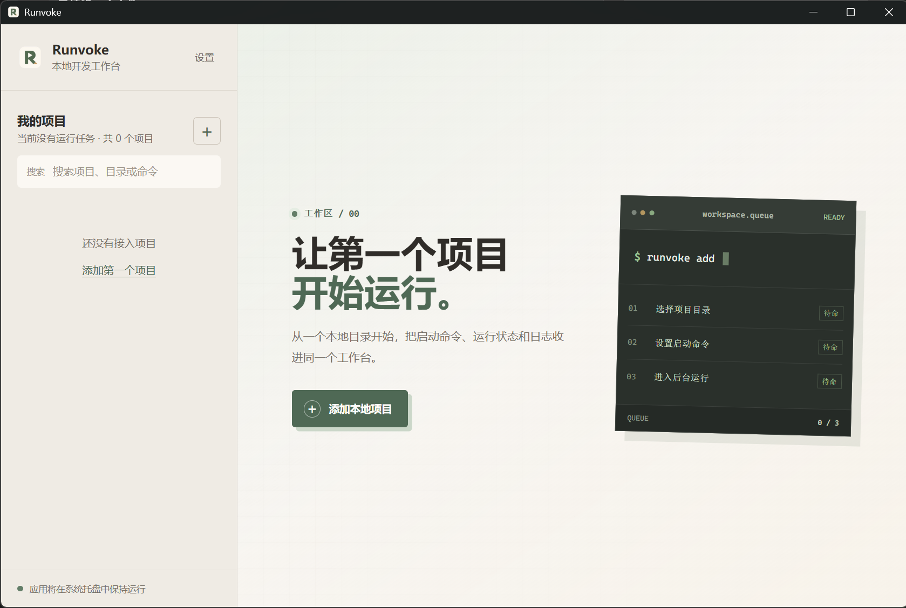
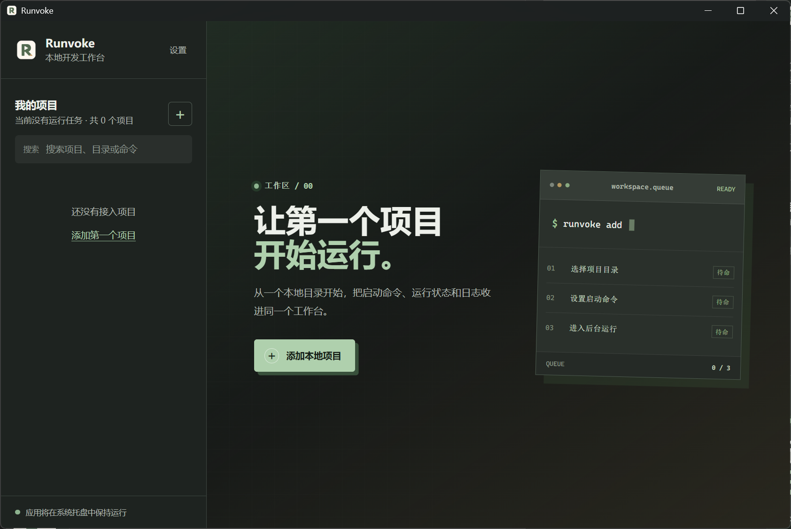
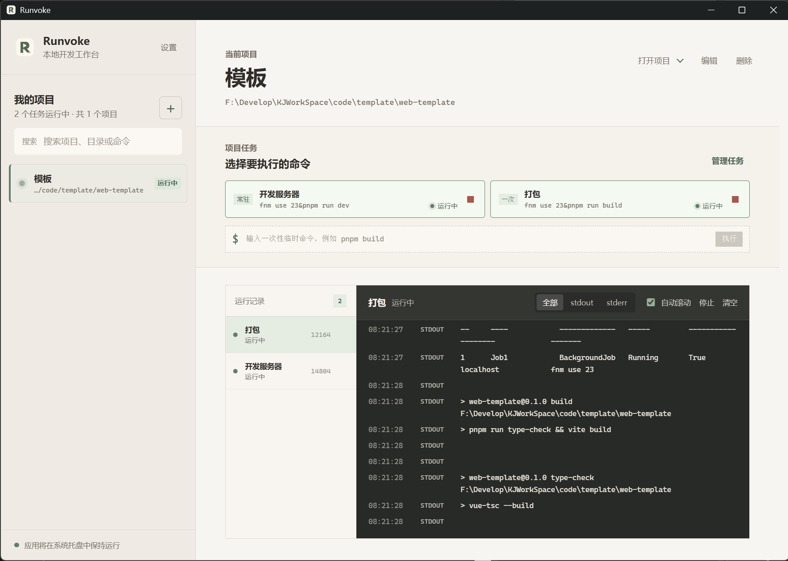

# Runvoke

<p align="center">
  一个用于集中运行、观察和管理本地开发项目的桌面工作台。
</p>

<p align="center">
  <a href="https://github.com/GezelligheidLin/Runvoke/releases"></a>
  
  
  
</p>

Runvoke 面向同时维护多个本地项目的开发者。它将项目目录、预设命令、临时命令、运行实例和日志放在同一处管理，避免在多个终端窗口之间切换，也无需记住每个项目的启动方式。

它不是远程部署平台，也不接管你的项目依赖或构建流程。Runvoke 只在本机启动你定义的命令，并提供清晰的状态、日志和进程控制。

## 界面预览

| 浅色工作区 | 深色工作区 |
| --- | --- |
|  |  |



## 为什么使用 Runvoke

本地开发通常会同时打开前端、后端、构建任务、Mock 服务和工具脚本。它们的命令、端口和输出散落在不同终端中，停止一个任务时也容易误伤其他进程。

Runvoke 以“项目 - 任务 - 运行实例”为单位管理这些工作：

- 一个项目保存目录、端口、环境变量和最多 3 条预设任务。
- 每次执行生成独立运行实例，因此同一项目的开发服务和构建任务可以并行运行。
- 每个实例独立记录启动状态、PID、退出码、标准输出、错误输出和系统日志。
- 停止实例时会回收其完整子进程树，减少残留端口和后台进程。

## 功能

### 项目与任务

- 从本地目录添加项目，并在常见项目清单中自动识别名称。
- 支持 `package.json`、`Cargo.toml`、`pyproject.toml`、`go.mod`、Maven、`.csproj`、`pubspec.yaml` 和 `composer.json` 等项目清单。
- 每个项目可保存最多 3 条预设任务，区分“常驻服务”和“一次任务”。
- 支持不保存的临时命令，适合临时构建、检查或脚本执行。
- 从项目菜单使用 VS Code 或系统文件管理器打开当前目录。

### 运行与日志

- 同时运行同一项目的多个任务，状态互不覆盖。
- 显示启动中、运行中、停止中、已停止、已完成和失败状态。
- 实时查看 `stdout`、`stderr` 和系统日志，可筛选输出并保持自动滚动。
- 可单独停止某次运行；活动实例会先要求确认。
- 可移除已结束的运行记录及日志，或一次清除所有已结束记录；活动任务不会被移除。

### 桌面体验

- 主窗口关闭后驻留系统托盘，可从托盘恢复窗口或退出应用。
- 支持随系统启动。
- 支持浅色和深色主题，主题偏好保存在本机。
- 禁用原生右键菜单，项目右键提供明确的编辑操作。

### 应用更新

- 使用 GitHub Releases 提供 Windows NSIS 安装包。
- 启动时和每 30 分钟自动检查更新，也可在设置中立即检查。
- 更新包通过 Tauri 签名校验后才会下载、安装并重启应用。

## 快速开始

### 安装使用

前往 [Releases](https://github.com/GezelligheidLin/Runvoke/releases) 下载最新的 `Runvoke_x.y.z_x64-setup.exe`，完成安装后启动 Runvoke。

1. 点击“添加项目”。
2. 选择项目目录，等待应用识别名称，或手动填写名称。
3. 配置预设任务，例如 `pnpm dev`、`cargo run` 或 `python main.py`。
4. 在项目工作区点击任务卡片启动；运行记录和日志会立即出现。

## 开发环境

### 前置条件

当前发布目标为 Windows。开发前请安装：

- Node.js 20 或更高版本。
- pnpm 10。
- Rust stable 工具链。
- [Tauri 2 Windows 开发前置条件](https://v2.tauri.app/start/prerequisites/)，包括 Microsoft C++ Build Tools 与 WebView2。

检查本地工具版本：

```powershell
node --version
pnpm --version
rustc --version
cargo --version
```

### 安装依赖

```powershell
git clone https://github.com/GezelligheidLin/Runvoke.git
cd Runvoke
pnpm install
```

### 启动桌面开发环境

```powershell
pnpm tauri dev
```

该命令会启动 Vite 前端开发服务器和 Tauri 桌面窗口。默认开发地址为 `http://localhost:1420`；不要只在浏览器中验证桌面能力，因为项目目录选择、进程管理、托盘和更新器依赖 Tauri 容器。

只调试前端界面时可以运行：

```powershell
pnpm dev
```

## 检查与构建

在提交改动前执行：

```powershell
pnpm typecheck
pnpm build
cargo check --manifest-path src-tauri/Cargo.toml
```

`pnpm build` 用于验证前端生产构建；它不会生成可分发的桌面安装包。

### 本地打包 Windows 安装包

```powershell
pnpm tauri build
```

构建完成后，NSIS 安装包位于：

```text
src-tauri/target/release/bundle/nsis/
```

启用了更新产物时，安装包旁还会生成 `.sig` 签名文件。请勿把私钥或本地签名密钥提交到仓库。

## 发布流程

项目通过 GitHub Actions 自动构建、签名并发布 GitHub Release。发布工作流位于 [`.github/workflows/release.yml`](.github/workflows/release.yml)，仅在推送 `v*` 标签时执行。

### 首次配置签名

应用内更新必须签名。请在安全的本机位置生成并保存密钥，再将私钥配置为 GitHub Repository Secret `TAURI_SIGNING_PRIVATE_KEY`。公钥已经配置在 `src-tauri/tauri.conf.json`，私钥绝不能提交到仓库、日志或 Issue。

示例命令：

```powershell
pnpm tauri signer generate -w "$env:USERPROFILE\.tauri\runvoke.key"
```

在 GitHub 仓库中依次打开 `Settings`、`Secrets and variables`、`Actions`，创建名为 `TAURI_SIGNING_PRIVATE_KEY` 的 Secret，并粘贴私钥完整内容。若在另一台电脑发布，应安全地导入同一把私钥；使用不同私钥会导致已安装版本拒绝更新。

### 发布一个新版本

1. 将 `package.json` 和 `src-tauri/tauri.conf.json` 的 `version` 同步改为同一版本号，例如 `0.1.7`。
2. 运行类型检查和生产构建。
3. 提交并推送 `main`。
4. 创建并推送同版本标签。

```powershell
pnpm typecheck
pnpm build

git add package.json src-tauri/tauri.conf.json
git commit -m "chore: release v0.1.7"
git push origin main

git tag -a v0.1.7 -m "Release v0.1.7"
git push origin v0.1.7
```

GitHub Actions 会执行以下工作：

1. 校验标签、`package.json` 和 Tauri 配置中的版本是否一致。
2. 构建 Windows NSIS 安装包并使用 `TAURI_SIGNING_PRIVATE_KEY` 签名。
3. 生成包含版本、下载链接和签名的 `latest.json`。
4. 创建 GitHub Release，并上传安装包、`.sig` 和 `latest.json`。

应用的更新端点为：

```text
https://github.com/GezelligheidLin/Runvoke/releases/latest/download/latest.json
```

## 项目结构

```text
src/                         Vue 前端、界面组件、类型与组合式函数
src/components/              项目配置表单等界面组件
src/composables/             项目、任务、运行状态和日志逻辑
src-tauri/                   Tauri 配置、Rust 进程管理与桌面能力
.github/workflows/           GitHub Actions 发布工作流
docs/images/                 README 使用的界面截图
```

## 技术栈

- [Tauri 2](https://v2.tauri.app/)
- [Vue 3](https://vuejs.org/)
- [TypeScript](https://www.typescriptlang.org/)
- [Vite](https://vite.dev/)
- [Rust](https://www.rust-lang.org/)
- [pnpm](https://pnpm.io/)

## 贡献与反馈

提交 Issue 前，请附上 Runvoke 版本、Windows 版本、复现步骤以及相关日志。涉及进程启动或停止的问题，请说明执行的命令、工作目录和预期行为，但不要提交令牌、密钥或其他敏感环境变量。

## License

本项目采用 [MIT License](LICENSE)。你可以自由使用、复制、修改、合并、发布、分发、再授权或销售软件副本，但须保留原始版权声明和许可声明。
