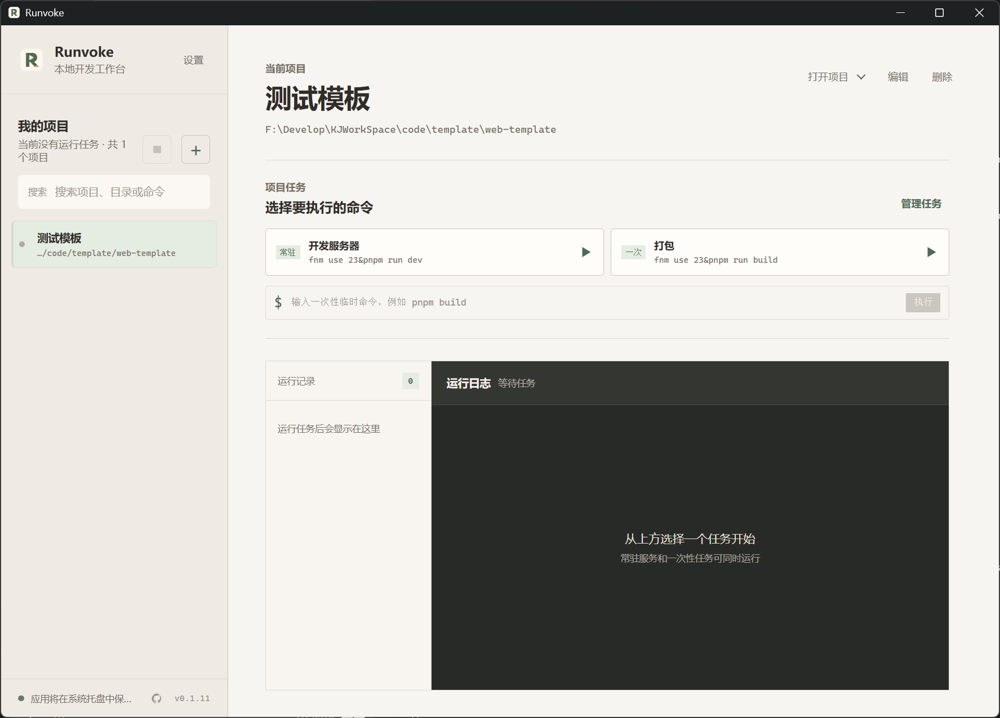
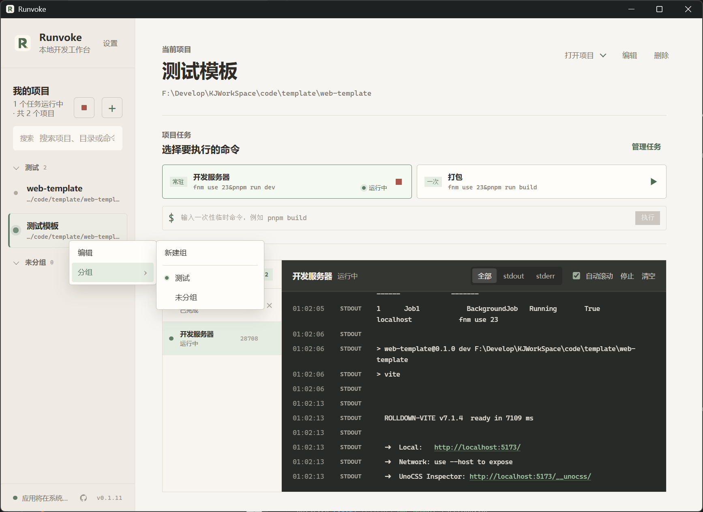

# Runvoke

<p align="center">
  一个集中运行、观察与管理本地开发项目的 Windows 桌面工作台。
</p>

<p align="center">
  <a href="https://github.com/GezelligheidLin/Runvoke/releases"></a>
  
  
  
  <a href="LICENSE"></a>
</p>

Runvoke 面向同时维护多个本地项目的开发者。它把项目目录、常用命令、临时命令、运行实例和实时日志放进同一个桌面工作台，让前端、后端、构建任务、Mock 服务和工具脚本不再散落在多个终端窗口中。

它只在本机执行你配置的命令，不接管项目依赖、构建与部署流程。远程项目管理、云端同步、团队协作和托管部署不属于当前范围。

## 界面预览

| 浅色工作区 | 深色工作区 |
| --- | --- |
|  |  |





## 核心能力

### 管理本地项目

- 选择本地项目目录后，自动从 `package.json`、`Cargo.toml`、`pyproject.toml`、`go.mod`、Maven、`.csproj`、`pubspec.yaml`、`composer.json` 等常见清单识别项目名称；已手动填写的名称不会被覆盖。
- 为项目保存工作目录、端口、环境变量和最多 3 条预设任务。
- 预设任务可区分为常驻服务和一次任务；另提供不保存的临时命令，适用于临时构建、检查或脚本执行。
- 通过项目操作菜单使用 VS Code 或系统文件管理器打开项目目录。
- 可从 VS Code、Code Insiders、VSCodium 或 Cursor 的最近工作区记录中批量导入项目；导入前可勾选、重读和确认，已存在的目录会自动跳过。所有导入清单均支持批量或单独选择“使用目录名”，以目录名替代扫描到的项目名称。

### 分组、搜索与导航

- 创建、重命名、折叠和删除本地项目分组；删除分组仅解除项目归属，不会删除项目。
- 支持项目组内排序、跨组拖拽和项目列表顺序持久化，重启后仍保持你的工作台布局。
- 搜索可快速过滤项目；项目右键菜单可直接编辑项目或调整其分组。
- 工作台和设置页均提供可拖拽分栏，侧栏宽度带最小约束并保存在本机。

### 多任务运行与日志

- 同一项目的开发服务、构建任务或临时命令可并行执行；每次执行都有独立运行实例，状态与日志互不覆盖。
- 清晰展示启动中、运行中、停止中、已停止、已完成和失败状态，以及 PID、退出码和执行记录。
- 实时查看 `stdout`、`stderr` 与系统日志，支持日志筛选与自动滚动；日志中的 HTTP/HTTPS 链接可按设置使用默认浏览器打开或复制。
- 可单独停止某次运行，停止时会回收完整子进程树；也可从项目侧栏停止全部活动任务。
- 已停止、已完成或失败的记录可单独移除，或经确认后一键清除；活动任务不会被误删。

### 桌面体验

- 关闭主窗口后驻留系统托盘，可从托盘恢复窗口或退出应用。
- 支持随系统启动，并限制为单实例：再次启动会激活已有窗口，不创建重复窗口或托盘图标。
- 提供浅色与深色主题，主题偏好与分栏宽度均持久化在本机。
- 左下角默认提供 GitHub 仓库入口，可在设置中隐藏，并通过系统默认浏览器打开仓库。
- 设置中的“项目配置”页面可打开本机项目、任务和分组配置目录；配置中的环境变量值可能包含敏感信息。
- 设置中的“从其他软件导入”可选择 Visual Studio Code 或 Cursor 并打开导入清单；应用更新后首次启动也会询问是否导入已有项目。
- 项目名称、路径、命令与运行记录等发生截断时，悬浮或键盘聚焦可显示完整内容提示。

### 本地 MCP 服务

Runvoke 可以作为本机 MCP Server 供 Agent 调用。服务默认关闭，只绑定 `127.0.0.1`，开启后在“设置”->“本地 MCP”中显示端口、端点、Bearer 令牌和可复制的客户端配置。令牌保存在本机应用配置中，不会写入日志或仓库。

MCP 支持读取项目、分组、运行状态和近期日志，编辑已有项目，调整分组，启动任务、执行一次性命令、停止单个或全部任务，修改受控设置以及请求检查更新。项目数据只返回环境变量键名，近期日志会按已保存的环境变量值脱敏。工具清单不包含删除项目、分组或运行记录的能力。项目导入时，Agent 必须提交候选项目的名称、目录和可选建议命令；Runvoke 只会打开独立的“Agent 请求纳入项目”筛选弹窗，用户自行勾选并点击“确认纳入”后才会写入，绝不读取或混入 VS Code/Cursor 的项目记录；更新安装也必须在 Runvoke 前台确认。

开启后，将设置页生成的配置粘贴到支持 Streamable HTTP 的 Agent 配置中，格式如下（端口和令牌以应用显示为准）：

```json
{
  "mcpServers": {
    "runvoke": {
      "type": "streamable-http",
      "url": "http://127.0.0.1:38465/mcp",
      "headers": {
        "Authorization": "Bearer <Runvoke 中显示的令牌>"
      }
    }
  }
}
```

MCP 只接受本机连接；关闭设置开关后服务立即停止。请不要把令牌、项目环境变量或包含敏感信息的配置目录提交到 Git 仓库。

### 应用更新

- GitHub Releases 提供 Windows NSIS 安装包的手动下载入口。
- 应用内更新通过阿里云 OSS 分发已签名的更新包；启动时、之后每 30 分钟以及设置页的“检查更新”按钮均可检测新版本。
- 发现新版本后会在应用内提示；安装前需确认，Runvoke 会先停止所有活动项目任务，再下载、校验、安装并重启。

## 快速使用

1. 从 [Releases](https://github.com/GezelligheidLin/Runvoke/releases) 下载最新的 `Runvoke_x.y.z_x64-setup.exe`，完成安装后启动 Runvoke。
2. 在工作台点击“添加项目”，先选择项目目录；等待名称自动识别，或自行修改名称。
3. 添加预设任务，例如 `pnpm dev`、`cargo run` 或 `python main.py`，并选择任务类型。
4. 在项目工作区启动任务，观察运行记录和实时日志；需要时执行临时命令或停止指定实例。
5. 使用侧栏的项目分组、搜索、拖拽排序与设置，让工作台贴合自己的开发习惯。

## 开发环境

### 前置条件

当前发布目标为 Windows。开发前请安装：

- Node.js 20 或更高版本。
- pnpm 10。
- Rust stable 工具链。
- [Tauri 2 Windows 开发前置条件](https://v2.tauri.app/start/prerequisites/)，包括 Microsoft C++ Build Tools 与 WebView2。

检查本地工具版本：

```powershell
node --version
pnpm --version
rustc --version
cargo --version
```

### 安装与启动

```powershell
git clone https://github.com/GezelligheidLin/Runvoke.git
cd Runvoke
pnpm install
pnpm tauri dev
```

`pnpm tauri dev` 会启动 Vite 前端开发服务器和 Tauri 桌面窗口。默认开发地址为 `http://localhost:1420`。项目目录选择、进程管理、系统托盘和更新器都依赖 Tauri 容器，应在桌面窗口中验证。

只调试前端界面时可运行：

```powershell
pnpm dev
```

### 分支约定

- `main` 只承载稳定正式版，并通过 `vX.Y.Z` 标签发布。
- `develop` 是新功能预览集成分支，使用类似 `0.1.13-dev.1` 的预发布版本号，可创建 GitHub Pre-release 供手动体验，但不会覆盖稳定更新清单或推送给正式用户。
- 独立功能从 `develop` 创建描述性的 `feature/<功能名>` 分支，验证后合并回 `develop`；稳定后再合并至 `main`。

## 检查与打包

提交改动前执行：

```powershell
pnpm typecheck
pnpm build
cargo check --manifest-path src-tauri/Cargo.toml
```

`pnpm build` 仅验证前端生产构建，不生成可分发的桌面安装包。构建 Windows NSIS 安装包：

```powershell
pnpm tauri build
```

安装包输出目录：

```text
src-tauri/target/release/bundle/nsis/
```

启用更新产物后，安装包旁还会生成 `.sig` 签名文件。请勿将签名私钥或 AccessKey 提交到仓库。

## 发布与应用内更新

发布工作流位于 [`.github/workflows/release.yml`](.github/workflows/release.yml)。推送 `v*` 标签后，GitHub Actions 会构建并签名 Windows 安装包，将版本化安装包与签名上传至阿里云 OSS，最后更新 `latest.json`；同一份产物也会附在 GitHub Release 中，作为手动下载安装的备份。

### 首次配置签名

应用内更新必须使用同一把签名私钥。请在安全的本机位置生成密钥，再将私钥完整内容配置为 GitHub Repository Secret `TAURI_SIGNING_PRIVATE_KEY`。公钥已配置在 `src-tauri/tauri.conf.json`；私钥不得提交到仓库、日志或 Issue。若在另一台电脑发布，请安全导入同一把私钥。

```powershell
pnpm tauri signer generate -w "$env:USERPROFILE\.tauri\runvoke.key"
```

### 配置 OSS 分发

在 GitHub 仓库的 `Settings` -> `Secrets and variables` -> `Actions` 中配置以下 Secrets。请使用具有目标 Bucket 最小权限的 RAM 用户凭据，避免使用阿里云主账号 AccessKey：

```text
ALIYUN_OSS_ACCESS_KEY_ID
ALIYUN_OSS_ACCESS_KEY_SECRET
```

再配置以下 Repository Variables：

```text
ALIYUN_OSS_BUCKET=runvoke-updates
ALIYUN_OSS_ENDPOINT=oss-cn-shanghai.aliyuncs.com
ALIYUN_OSS_PUBLIC_BASE_URL=https://runvoke-updates.oss-cn-shanghai.aliyuncs.com/runvoke
```

客户端读取的更新清单地址为：

```text
https://runvoke-updates.oss-cn-shanghai.aliyuncs.com/runvoke/latest.json
```

### 发布一个新版本

1. 将 `package.json`、`src-tauri/tauri.conf.json` 与 `src-tauri/Cargo.toml` 的版本统一改为同一版本号。
2. 更新 `RELEASE_NOTES.md`，说明新增功能、修复与体验优化。
3. 完成检查后提交并推送 `main`，再创建并推送同版本标签。

```powershell
pnpm typecheck
pnpm build

git add package.json src-tauri/tauri.conf.json src-tauri/Cargo.toml RELEASE_NOTES.md
git commit -m "chore: release v0.1.12"
git push origin main

git tag -a v0.1.12 -m "Release v0.1.12"
git push origin v0.1.12
```

工作流会校验标签与三个版本文件一致后再发布。先上传版本化安装包及其 `.sig`，最后发布更新清单，避免客户端读取到不完整的新版本。

## 项目结构

```text
src/                         Vue 前端、界面组件、类型与组合式函数
src/components/              项目、分组、设置、分栏与 Tooltip 组件
src-tauri/                   Tauri 配置、Rust 进程管理与桌面能力
.github/workflows/           GitHub Actions 发布工作流
docs/images/                 README 使用的界面截图
```

## 技术栈

- [Tauri 2](https://v2.tauri.app/)
- [Vue 3](https://vuejs.org/)
- [TypeScript](https://www.typescriptlang.org/)
- [Vite](https://vite.dev/)
- [Rust](https://www.rust-lang.org/)
- [pnpm](https://pnpm.io/)
- [Reka UI](https://reka-ui.com/) 与 shadcn-vue Tooltip

## 贡献与反馈

提交 Issue 时请附上 Runvoke 版本、Windows 版本、复现步骤和相关日志。涉及进程启动或停止的问题，请说明执行的命令、工作目录和预期行为，但不要提交令牌、密钥或其他敏感环境变量。

## License

本项目采用 [MIT License](LICENSE)。
